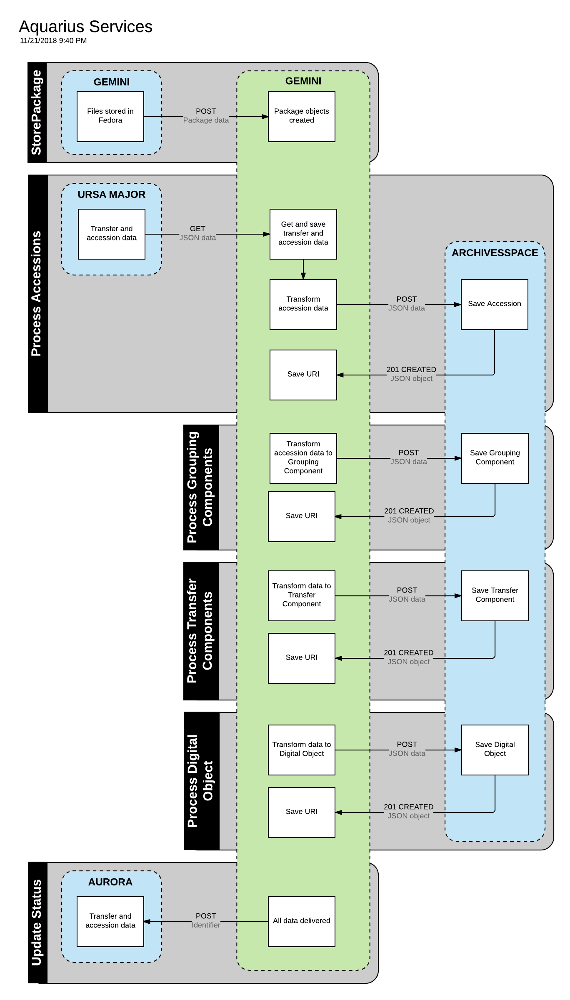

# aquarius

A microservice to transform and deliver Accessions, Archival Objects and Digital Objects to ArchivesSpace.

aquarius is part of [Project Electron](https://github.com/RockefellerArchiveCenter/project_electron), an initiative to build sustainable, open and user-centered infrastructure for the archival management of digital records at the [Rockefeller Archive Center](http://rockarch.org/).

## Setup

Install [git](https://git-scm.com/) and clone the repository

    $ git clone git@github.com:RockefellerArchiveCenter/aquarius.git

Install [Docker](https://store.docker.com/search?type=edition&offering=community) and run docker-compose from the root directory

    $ cd aquarius
    $ docker-compose up

Once the application starts successfully, you should be able to access the application in your browser at `http://localhost:8000`

When you're done, shut down docker-compose

    $ docker-compose down

Or, if you want to remove all data

    $ docker-compose down -v

### Configuration

You will need to edit configuration values in `aquarius/config.py` to point to your instance of ArchivesSpace.

## Services

Aquarius has six services, all of which are exposed via HTTP endpoints (see [Routes](#routes) section below):

* Store Packages - saves package data received via a POST request. For an example of the package data aquarius expects see `fixtures/data/`.
* Transform Accessions - transforms accession data and delivers it to ArchivesSpace as an accession.
* Transform Grouping Components - transforms accession data into a grouping component and delivers it to ArchivesSpace as an archival object.
* Transform Transfer Component - transforms transfer data and delivers it to ArchivesSpace as an archival object.
* Transform Digital Component - transforms transfer data and delivers it to ArchivesSpace as a digital object.
* Update Status - sends updated data to Aurora.

### Routes

| Method | URL | Parameters | Response  | Behavior  |
|--------|-----|---|---|---|
|POST|/packages| |200|Saves new package objects|
|GET|/packages| |200|Returns a list of packages|
|GET|/packages/{id}| |200|Returns data about an individual package|
|POST|/accessions| |200|Runs the AccessionRoutine process|
|POST|/grouping-components| |200|Runs the GroupingComponentRoutine process|
|POST|/transfer-components| |200|Runs the TransferComponentRoutine process|
|POST|/digital-objects| |200|Runs the DigitalObjectRoutine process|
|POST|/send-update| |200|Sends updated data to Aurora|
|GET|/status||200|Return the status of the microservice|
|GET|/schema.json||200|Returns the OpenAPI schema for this application|

### Logging

aquarius uses `structlog` to output structured JSON logs. Logging can be configured in `aquarius/settings.py`.

### ArchivesSpace configuration

In order to successfully save data to ArchivesSpace, you will have to make some changes to some of the default enumerations:

* Accession Acquisition Type: add `donation`
* Extent Extent Type: add `bytes` and `files`
* File Version Use Statement: add `master` and `service-edited`

## License

This code is released under an [MIT License](LICENSE).
