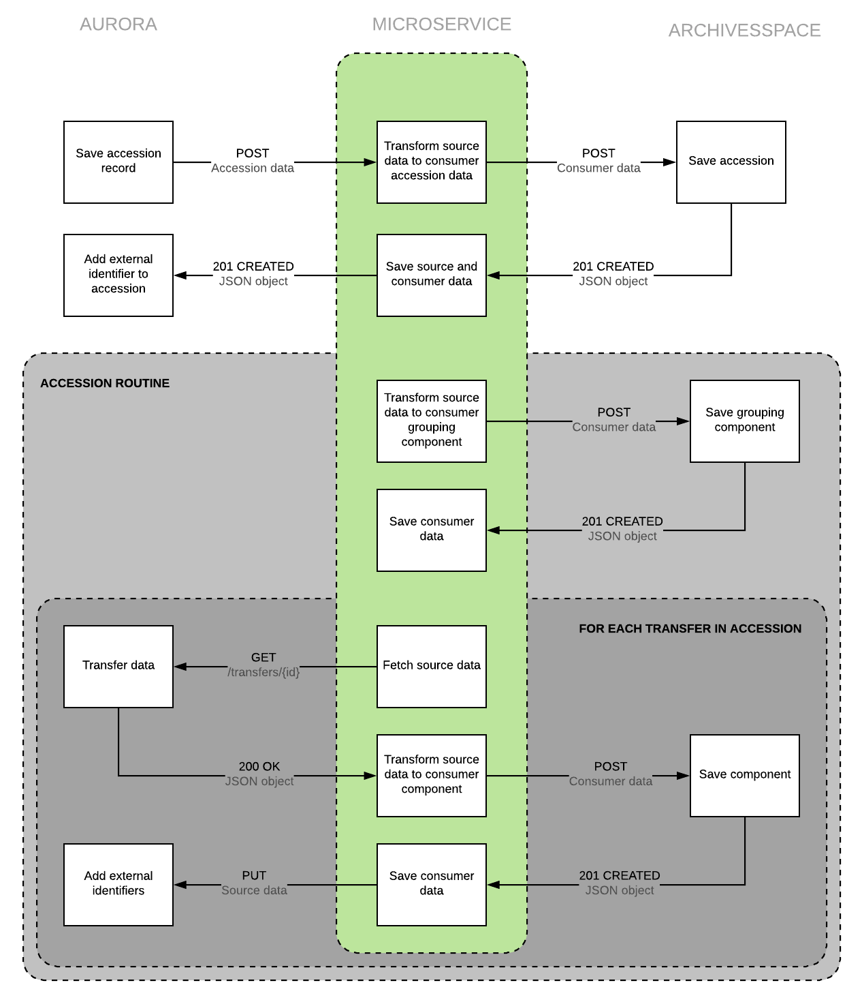

# Aquarius

A microservice to fetch data from Aurora, then transform and deliver it to ArchivesSpace.

## Setup

Clone the repository

    $ git clone git@github.com:RockefellerArchiveCenter/aquarius.git

Install [Docker](https://store.docker.com/search?type=edition&offering=community) (trust me, it makes things a lot easier)

Run docker-compose from the root directory

    $ cd aquarius
    $ docker-compose up

Once the application starts successfully, you should be able to access the application in your browser at `http://localhost:8000`

When you're done, shut down docker-compose

    $ docker-compose down

### Data Persistence

Right now, the Docker container does not persist any data, which means that when you shut down the services using `docker-compose down`, you'll lose any data you entered. In order to facilitate development, a few default objects will be created for you when you run `docker-compose up`.

### Users

By default a new superuser is created. See `entrypoint.sh` for those users and associated credentials. THIS IS FOR TESTING PURPOSES ONLY, BE SURE TO CHANGE THIS IN PRODUCTION.

## Usage

This microservice consists of two basic interactions:
1. Accepts POST request containing accession data from Aurora, and then transforms that data and saves an accession record in ArchivesSpace.  
2. A cron job that looks for all unprocessed accessions, runs data transformations and saves components for each transfer in that accession in ArchivesSpace.

For an example of the data Aquarius expects from Aurora, see `fixtures/data/accession.json`.

### Routes

| Method | URL | Parameters | Response  | Behavior  |
|--------|-----|---|---|---|
|POST|/transform| |200|Accepts accession data from Aurora, transforms it and saves a new accession in ArchivesSpace|
|GET|/source_objects|`type` - object type (for example component, accession)   `last_modified` - unix timestamp |200|Returns a list of Aurora objects|
|GET|/source_objects/{id}| |200|Returns data about an individual Aurora object|
|GET|/consumer_objects|`type` - object type (for example component, accession)   `last_modified` - unix timestamp |200|Returns a list of consumer objects|
|GET|/consumer_objects/{id}| |200|Returns data about an individual consumer object|
|GET|/status||200|Return the status of the microservice

### Authentication

This application uses [JSON Web Token Authentication](https://github.com/GetBlimp/django-rest-framework-jwt). In order to get a token, you must POST a valid username and password to the `/get-token/` endpoint:

    curl http://localhost:8000/get-token/ -d username=user&password=pass123

The response will contain a token

    { 'token' : '9944b09199c62bcf9418ad846dd0e4bbdfc6ee4b' }

This token key should be included in the `Authorization` header of your requests, prefixed by the string "JWT" followed by whitespace.

    Authorization: JWT 9944b09199c62bcf9418ad846dd0e4bbdfc6ee4b

### Logging

aquarius uses `structlog` to output structured JSON logs. Logging can be configured in `aquarius/settings.py`.

## License

MIT License. See [LICENSE](LICENSE) for details.
