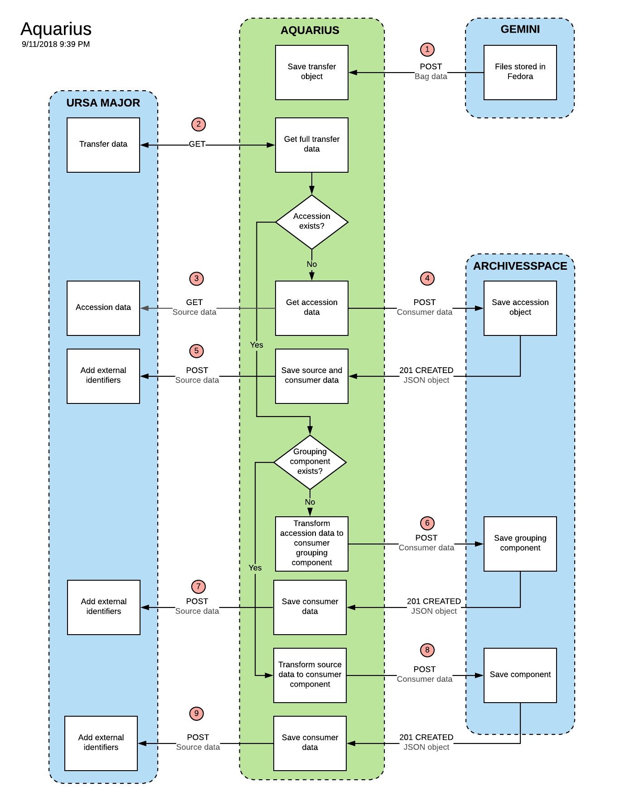

# Aquarius

A microservice to fetch data from Aurora, then transform and deliver it to ArchivesSpace.

## Setup

Clone the repository

    $ git clone git@github.com:RockefellerArchiveCenter/aquarius.git

Install [Docker](https://store.docker.com/search?type=edition&offering=community) (trust me, it makes things a lot easier)

Run docker-compose from the root directory

    $ cd aquarius
    $ docker-compose up

Once the application starts successfully, you should be able to access the application in your browser at `http://localhost:8000`

When you're done, shut down docker-compose

    $ docker-compose down

### Data Persistence

Right now, the Docker container does not persist any data, which means that when you shut down the services using `docker-compose down`, you'll lose any data you entered. In order to facilitate development, a few default objects will be created for you when you run `docker-compose up`.

## Usage

For an example of the data Aquarius expects from Aurora, see `fixtures/data/accession.json`.

### Routes

| Method | URL | Parameters | Response  | Behavior  |
|--------|-----|---|---|---|
|POST|/transfers| |200|Accepts accession data from Aurora, transforms it and saves a new accession in ArchivesSpace|
|GET|/transfers|`last_modified` - unix timestamp |200|Returns a list of Aurora objects|
|GET|/transfers/{id}| |200|Returns data about an individual transfer|
|GET|/status||200|Return the status of the microservice

### Logging

aquarius uses `structlog` to output structured JSON logs. Logging can be configured in `aquarius/settings.py`.

## License

MIT License. See [LICENSE](LICENSE) for details.
